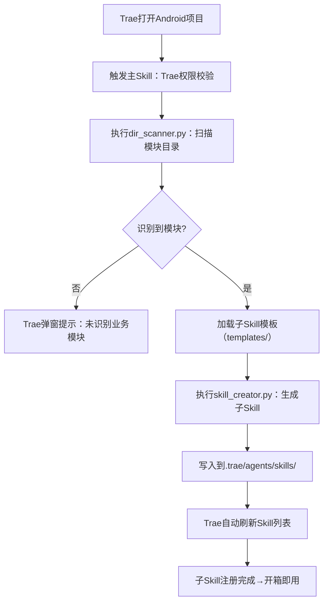

# ModuleSkillGenerator（Trae专属）
## 可视化流程图

## 功能说明
- **触发时机**：Trae IDE 打开 Android 项目时自动触发
- **触发类型**：`trae-project-opened` 触发器
- **优先级**：100（最高优先级）
- **执行流程**：
  1. 权限校验
  2. 模块扫描
  3. 子Skill生成
  4. 列表刷新

## 配置参数
- **project_version**：v1.0
- **module_root**：app/src/main/java/com/example/webrtctest/
- **skip_dirs**：.git, venv, build, test
- **skill_output_dir**：.trae/agents/skills/
- **kb_root**：.trae/agents/skills/skill-generator-main/knowledge-base/

## 故障排查
1. **未自动触发**：检查 Trae IDE 偏好设置中的「自动触发」选项是否启用
2. **模块未识别**：检查 `module_root` 配置是否正确
3. **Skill 未生成**：检查文件权限是否正确
4. **无权限执行**：检查 `permissions` 配置是否完整

## 手动触发
如果自动触发失败，可以手动触发：
1. 在 Trae IDE 中输入：`扫描项目模块`
2. 或输入：`生成子 Skill`
3. 或输入：`刷新 Skill 配置`