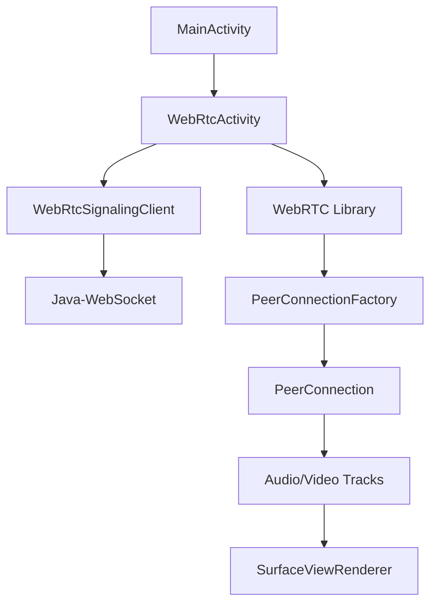

# WebRTC Android 项目说明文档

## 项目概述

本项目是一个基于 Android 平台的 WebRTC 视频通话应用，实现了基本的实时音视频通信功能。项目使用 Java-WebSocket 库进行信令通信，WebRTC 进行音视频数据传输。

## 项目架构

```
WebRtcDemo/
├── app/
│   ├── src/main/java/com/example/webrtctest/
│   │   ├── MainActivity.java           # 应用主入口
│   │   ├── WebRtcActivity.java         # WebRTC 核心功能实现
│   │   ├── WebRtcSignalingClient.java  # WebSocket 信令客户端
│   │   └── WebSocketClientWrapper.java # 通用 WebSocket 客户端包装
│   ├── src/main/res/
│   │   ├── layout/
│   │   │   ├── activity_main.xml      # 主界面布局
│   │   │   └── activity_webrtc.xml    # WebRTC 界面布局
│   │   └── drawable/                  # 图标资源文件
│   └── build.gradle                   # 模块级构建配置
├── gradle/
│   └── libs.versions.toml             # 依赖版本管理
├── build.gradle                       # 项目级构建配置
└── settings.gradle                    # 项目设置
```

## 核心模块

### 1. 信令模块 (Signaling Module)

**主要文件**: WebRtcSignalingClient.java

**功能**:
- 建立和维护 WebSocket 连接
- 发送和接收信令消息 (SDP, ICE candidates)
- 房间管理 (创建、加入、离开)
- 自动重连机制

**主要方法**:
- `connectAsync()` - 异步建立 WebSocket 连接
- `createRoom()` / `joinRoom()` / `leaveRoom()` - 房间操作
- `sendOffer()` / `sendAnswer()` - SDP 信令发送
- `sendIceCandidate()` - ICE 候选发送

### 2. WebRTC 核心模块 (WebRTC Core Module)

**主要文件**: WebRtcActivity.java

**功能**:
- WebRTC PeerConnection 管理
- 音视频采集和渲染
- 与信令模块交互
- 用户界面控制

**主要组件**:
- PeerConnectionFactory - WebRTC 工厂类
- PeerConnection - WebRTC 连接核心类
- SurfaceViewRenderer - 视频渲染视图
- AudioTrack/VideoTrack - 音视频轨道

### 3. UI 模块 (User Interface Module)

**主要文件**: 
- activity_webrtc.xml (布局文件)
- WebRtcActivity.java (交互逻辑)

**功能**:
- 显示本地和远程视频
- 提供控制按钮 (麦克风、摄像头、挂断等)
- 显示会议信息和状态

## 调用关系



## 信令流程

1. **连接建立**:
   - WebRtcActivity 初始化 WebRtcSignalingClient
   - 调用 `connectAsync()` 建立 WebSocket 连接

2. **房间加入**:
   - 用户点击加入房间按钮
   - WebRtcActivity 调用 `signalingClient.joinRoom()`
   - 信令服务器广播用户加入事件

3. **WebRTC 连接建立**:
   - 发起方创建 Offer 并通过信令发送
   - 接收方收到 Offer 后创建 Answer 并回传
   - 双方交换 ICE 候选完成连接

4. **通话进行**:
   - 音视频数据通过 WebRTC 传输
   - 信令通道保持用于状态同步

5. **连接断开**:
   - 用户点击挂断按钮
   - 清理 WebRTC 和 WebSocket 资源

## 依赖库

- **WebRTC**: com.infobip:google-webrtc:1.0.43591
- **WebSocket**: org.java-websocket:Java-WebSocket:1.5.3
- **Android Support**: androidx.appcompat, material design 等

## 异常处理

项目中对所有网络操作和 JSON 处理都添加了异常捕获，确保:
- 网络连接失败时有重连机制
- 信令发送失败时有错误回调
- JSON 解析错误时有提示信息
- UI 操作在主线程中执行

## 待完善功能

1. 音视频采集的具体实现
2. PeerConnection 的完整创建逻辑
3. 实际的信令服务器连接地址配置
4. 更完善的用户界面交互
5. 权限申请和处理