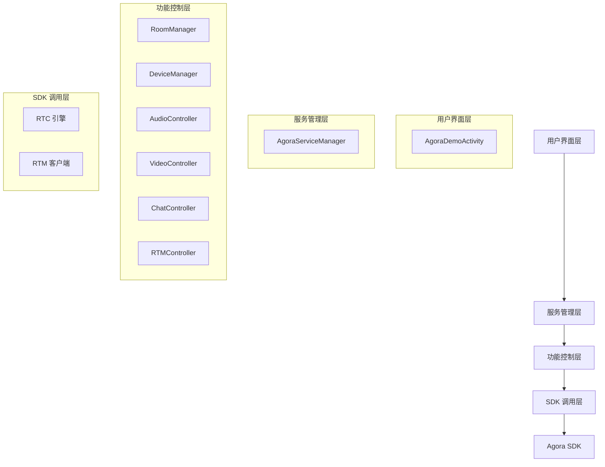

# Agora 音视频通信项目架构与实现说明

## 1. 整体框架

### 1.1 项目架构

本项目采用分层架构设计，基于 Agora SDK 实现音视频通信功能。整体架构分为以下几个层次：



### 1.2 核心组件关系

- **AgoraServiceManager**：服务管理核心，负责初始化和协调各个功能模块
- **RoomManager**：房间管理，处理频道创建、加入、离开等操作
- **DeviceManager**：设备管理，处理音视频设备操作和状态监听
- **AudioController**：音频控制，处理音频相关操作
- **VideoController**：视频控制，处理视频相关操作
- **ChatController**：聊天控制，处理文本消息
- **RTMController**：实时消息控制，基于 RTM SDK

## 2. 具体功能分工

### 2.1 AgoraServiceManager

**职责**：服务管理核心，负责初始化和协调各个功能模块

**主要功能**：
- 初始化 DeviceManager 和 RoomManager
- 建立模块间的事件监听连接
- 提供统一的服务接口给上层调用
- 管理服务生命周期

**关键实现**：
- 初始化时创建 DeviceManager 和 RoomManager 实例
- 设置 DeviceManager 的 RoomEventListener，实现事件转发
- 设置 DeviceManager 的 DeviceStatusListener，实现设备状态转发
- 提供 joinRoom、createRoom、leaveRoom 等统一接口

### 2.2 RoomManager

**职责**：房间管理，处理频道相关操作

**主要功能**：
- 创建和加入聊天房间
- 处理加入频道超时逻辑
- 管理房间成员列表
- 处理用户加入/离开事件
- 发送和接收聊天消息

**关键实现**：
- 使用 RTM SDK 实现实时消息通信
- 维护房间成员列表和状态
- 实现加入频道超时检测机制
- 处理 DeviceManager 转发的事件

### 2.3 DeviceManager

**职责**：设备管理，处理音视频设备操作和状态监听

**主要功能**：
- 初始化 RTC 引擎
- 管理音视频设备状态
- 处理本地和远程视频状态变化
- 提供音视频设备控制接口

**关键实现**：
- 实现 RTC 引擎的事件回调
- 管理本地和远程视频视图
- 处理音频设备变化
- 转发事件给 RoomManager

### 2.4 其他控制器

- **AudioController**：音频控制，处理静音、音量调节等操作
- **VideoController**：视频控制，处理视频开关、摄像头切换等操作
- **ChatController**：聊天控制，处理文本消息的发送和接收
- **RTMController**：实时消息控制，基于 RTM SDK 实现消息通信

## 3. 推流拉流逻辑

### 3.1 推流逻辑

**本地视频推流**：
1. 用户点击开启视频按钮
2. `toggleVideo()` 方法被调用
3. 创建本地 SurfaceView 并添加到网格布局
4. 调用 `DeviceManager.setupLocalVideo()` 设置本地视频视图
5. 调用 `DeviceManager.enableLocalVideo(true)` 启用本地视频
6. 调用 `DeviceManager.startPreview()` 开始预览
7. 调用 `DeviceManager.muteLocalVideo(false)` 取消本地视频静音
8. 视频流开始推送到频道

**本地音频推流**：
1. 用户点击开启音频按钮
2. `toggleAudio()` 方法被调用
3. 调用 `DeviceManager.enableLocalAudio(true)` 启用本地音频
4. 调用 `DeviceManager.muteLocalAudioStream(false)` 取消本地音频静音
5. 音频流开始推送到频道

### 3.2 拉流逻辑

**远程视频拉流**：
1. 远程用户加入频道并开启视频
2. RTC 引擎触发 `onUserJoined` 事件
3. RTC 引擎触发 `onRemoteVideoStateChanged` 事件，状态为 `REMOTE_VIDEO_STATE_STARTING` 或 `REMOTE_VIDEO_STATE_DECODING`
4. `DeviceManager` 捕获事件并转发给 `RoomManager`
5. `RoomManager` 转发给 `AgoraDemoActivity`
6. `AgoraDemoActivity` 调用 `setupRemoteVideoView()` 创建远程视频视图
7. 调用 `DeviceManager.setupRemoteVideo()` 设置远程视频视图
8. 开始接收并解码远程视频流

**远程音频拉流**：
1. 远程用户加入频道并开启音频
2. RTC 引擎自动开始接收远程音频流
3. 音频流解码后通过设备播放

### 3.3 流控制机制

- **自动订阅**：加入频道时设置 `autoSubscribeAudio` 和 `autoSubscribeVideo` 为 true，自动接收远程流
- **手动控制**：通过 `muteLocalAudioStream` 和 `muteLocalVideoStream` 控制本地流的推送
- **状态监听**：通过 `onRemoteVideoStateChanged` 监听远程流状态变化

## 4. RTM 与 RTC 的应用

### 4.1 RTC (Real-time Communication) 应用

**主要功能**：
- 音视频流的实时传输
- 频道管理（加入、离开频道）
- 设备管理和状态监听
- 视频渲染和控制

**关键应用场景**：
- 视频通话：本地和远程视频的实时传输
- 音频通话：本地和远程音频的实时传输
- 视频状态管理：监控视频流的开始、停止、冻结等状态

**核心 API**：
- `RtcEngine.create()`：创建 RTC 引擎实例
- `joinChannel()`：加入频道
- `leaveChannel()`：离开频道
- `setupLocalVideo()`：设置本地视频视图
- `setupRemoteVideo()`：设置远程视频视图
- `muteLocalAudioStream()`：静音本地音频
- `muteLocalVideoStream()`：静音本地视频

### 4.2 RTM (Real-time Messaging) 应用

**主要功能**：
- 实时文本消息通信
- 频道消息广播
- 点对点消息
- 在线状态管理

**关键应用场景**：
- 文本聊天：用户间发送文本消息
- 频道通知：发送频道级别的通知消息
- 信令传输：用于业务逻辑的信令传递

**核心 API**：
- `RtmClient.create()`：创建 RTM 客户端实例
- `login()`：登录 RTM 系统
- `logout()`：登出 RTM 系统
- `publish()`：发送消息
- `subscribe()`：订阅消息

### 4.3 RTM 与 RTC 的协同工作

- **RTC 负责音视频流**：处理实时音视频的编码、传输和解码
- **RTM 负责信令和消息**：处理文本消息和业务信令
- **事件协同**：
  1. RTC 检测到用户加入/离开，通过事件通知 RoomManager
  2. RoomManager 更新成员列表
  3. 重要事件通过 RTM 发送通知

## 5. SDK 协议与技术

### 5.1 核心协议

Agora SDK 内部使用多种协议实现实时通信功能：

| 协议类型 | 用途 | 说明 |
|---------|------|------|
| SRTP | 安全实时传输协议 | 用于音视频流的加密传输 |
| RTP | 实时传输协议 | 用于音视频数据的传输 |
| RTCP | 实时传输控制协议 | 用于监控 QoS 和反馈 |
| UDP | 用户数据报协议 | 作为底层传输协议，低延迟 |
| TCP | 传输控制协议 | 用于可靠数据传输（如信令） |
| WebSocket | 实时通信协议 | 用于 RTM 消息传输 |

### 5.2 技术特性

- **低延迟**：采用 UDP 协议和优化的编解码算法，实现低延迟传输
- **自适应码率**：根据网络状况自动调整码率，保证通话质量
- **抗网络抖动**：使用缓冲区和丢包重传机制，抵抗网络抖动
- **噪声抑制**：内置噪声抑制算法，提高音频质量
- **回声消除**：内置回声消除算法，避免回声干扰
- **视频编解码**：支持 H.264、H.265、AV1 等编解码格式

### 5.3 SDK 组件

项目中集成的 SDK 组件：

- **agora-rtc-sdk**：核心音视频通信 SDK
- **agora-rtm-sdk**：实时消息 SDK
- **agora-chat-sdk**：聊天 SDK

### 5.4 扩展功能

通过 SDK 扩展实现的功能：

- **屏幕共享**：通过 AgoraScreenShareExtension 实现
- **AI 降噪**：通过 libagora_ai_noise_suppression_extension.so 实现
- **AI 回声消除**：通过 libagora_ai_echo_cancellation_extension.so 实现
- **音频美化**：通过 libagora_audio_beauty_extension.so 实现
- **视频增强**：通过 libagora_clear_vision_extension.so 实现
- **面部捕捉**：通过 libagora_face_capture_extension.so 实现
- **面部检测**：通过 libagora_face_detection_extension.so 实现
- **唇音同步**：通过 libagora_lip_sync_extension.so 实现
- **空间音频**：通过 libagora_spatial_audio_extension.so 实现

## 6. 关键代码实现

### 6.1 服务初始化

```java
// AgoraServiceManager 初始化
public void initialize(Context context) throws Exception {
    // 初始化 DeviceManager
    deviceManager = new DeviceManager(context, AgoraConfig.APP_ID);
    deviceManager.initialize();
    
    // 初始化 RoomManager
    roomManager = new RoomManager(context, AgoraConfig.APP_ID);
    roomManager.setRtcEngine(deviceManager.getRtcEngine());
    roomManager.initialize();
    
    // 设置事件监听连接
    setupEventListeners();
}
```

### 6.2 加入频道

```java
// RoomManager 创建聊天房间
public void createChatRoom(String channelName, String userId, String token, boolean isBroadcaster) {
    // 后台线程执行加入操作
    new Thread(() -> {
        try {
            // 设置频道参数
            this.currentChannelName = channelName;
            this.currentUserId = userId;
            
            // 加入频道
            ChannelMediaOptions options = new ChannelMediaOptions();
            options.channelProfile = Constants.CHANNEL_PROFILE_LIVE_BROADCASTING;
            options.clientRoleType = Constants.CLIENT_ROLE_BROADCASTER;
            options.autoSubscribeAudio = true;
            options.autoSubscribeVideo = true;
            
            // 调用 RTC 引擎加入频道
            rtcEngine.joinChannel(token, channelName, 0, options);
            
            // 超时检测
            startTimeoutCheck();
        } catch (Exception e) {
            // 异常处理
        }
    }).start();
}
```

### 6.3 视频状态监听

```java
// DeviceManager 视频状态监听
@Override
public void onRemoteVideoStateChanged(int uid, int state, int reason, int elapsed) {
    // 判断视频是否可用
    boolean enabled = (state == Constants.REMOTE_VIDEO_STATE_DECODING || 
            state == Constants.REMOTE_VIDEO_STATE_STARTING);
    
    // 通知状态变化
    if (deviceStatusListener != null) {
        deviceStatusListener.onRemoteVideoStateChanged(uid, enabled);
    }
}
```

### 6.4 网格布局管理

```java
// AgoraDemoActivity 更新网格布局
private void updateGridLayout() {
    // 根据视频数量计算行列数
    int videoCount = videoGridLayout.getChildCount();
    int columnCount = 2;
    int rowCount = Math.max(1, (videoCount + 1) / 2);
    
    // 设置网格布局参数
    videoGridLayout.setColumnCount(columnCount);
    videoGridLayout.setRowCount(rowCount);
}
```

## 7. 技术特点与优势

### 7.1 技术特点

1. **模块化设计**：采用模块化设计，各功能模块职责清晰，易于维护和扩展
2. **事件驱动**：基于事件监听机制，实现模块间的解耦和通信
3. **异步处理**：耗时操作采用后台线程执行，避免阻塞主线程
4. **状态管理**：完善的状态管理机制，确保系统稳定性
5. **错误处理**：全面的错误处理和日志记录，便于问题定位

### 7.2 优势

1. **低延迟**：基于 Agora SDK 的优化，实现低延迟音视频通信
2. **高可靠性**：完善的错误处理和状态管理，提高系统可靠性
3. **易于扩展**：模块化设计，便于功能扩展和定制
4. **良好的用户体验**：流畅的音视频效果和响应及时的操作反馈
5. **全面的功能**：集成了音视频通话、文本聊天等多种功能

## 8. 总结

本项目基于 Agora SDK 实现了一套完整的音视频通信系统，具有以下特点：

- **架构清晰**：采用分层架构设计，模块职责明确
- **功能完善**：支持视频通话、音频通话、文本聊天等功能
- **性能优化**：采用异步处理、状态管理等机制，优化系统性能
- **易于扩展**：模块化设计，便于功能扩展和定制

通过本项目的实现，可以快速构建具有实时音视频通信能力的应用，满足各种实时互动场景的需求。